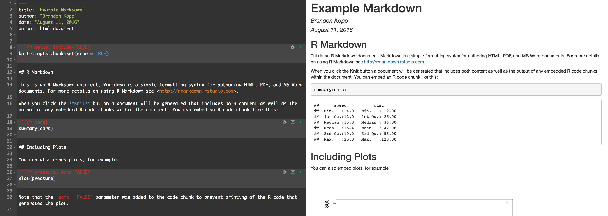
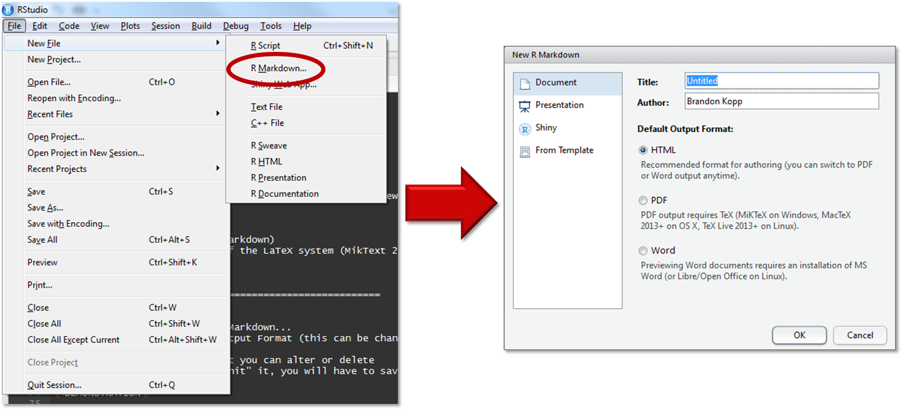
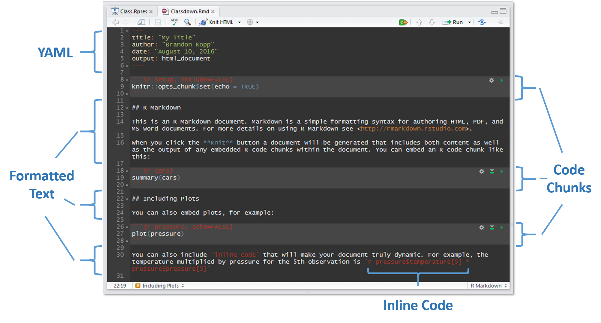
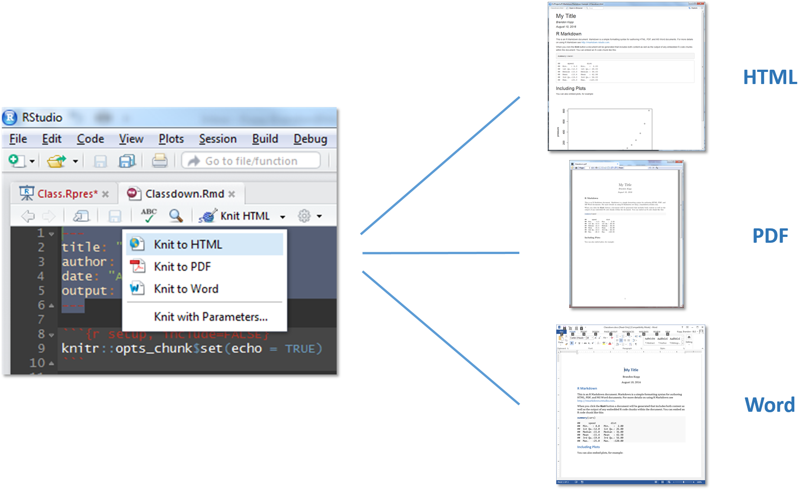

```{r setup, include=FALSE}
knitr::opts_chunk$set(echo = TRUE)
```

<br>

Introduction
========================================================

I was asked to put together a 2-hour introduction on R Markdown for my colleagues at work. This document is a modified version of the slides that I used during that talk.  Because R Markdown is easier to work with than R Presentations, I have added a bit more material here.


<hr>
Outline
========================================================

This document is meant to provide an overview of R Markdown

- What is R Markdown and Why Use It
- Getting Started
- Orientation to R Markdown Documents
- Formatted Text
- Code Chunks
- Inline Code
- Output as...
- Additional Resources


<hr>
What is R Markdown?
========================================================

R Markdown is a tool within RStudio that allows you to write documents, presentations, or webpages that **combine written text with analytical code.**

- The text in the document can be fully formatted in a report style (e.g., with headers, bolded text, hyperlinks, etc.)
- You can choose to make your code visible or not
- Documents can be output as PDFs, Word Documents, HTML, and other formats




<hr>
Why Use R Markdown
========================================================

To me, the strongest argument is that everything is in one place. In graduate school, I did quite a bit of work with Excel and SPSS. Not everything was coded. I would be hard-pressed to perfectly recreate every ANOVA result, every mean, every p-value.  With R Markdown, you don't get a final report unless the code runs perfectly throughout the document.

- Documents with embedded code are reproducible
- The document will serve as a record for how you arrived at the results you include in your papers
- You can pass on your code to readers in addition to the report content
- Dynamic documents can change as data are updated
- Documents can also be used for future data releases and/or different subsets of data


<hr>
My Experience With R Markdown
========================================================

I have had about 1 year of experience with R and 9 months of experience with R Markdown.

- Coursera Data Science Specialization Classes
- CE FR Survey Report
- Research reports
- [RPubs reports](http://rpubs.com/brandonkopp)


<hr>
Getting Started
========================================================

Before you start creating documents you'll need to do a few things first.

1. Download R
2. Download RStudio
3. Install Packages (knitr, rmarkdown) *may not be necessary in newer versions

  ```{r eval=FALSE}
  install.packages(c("knitr","rmarkdown"))
  ```
  
4. Install some distribution of the LaTeX system (e.g., MikText). This is necessary if you want to output to PDF or Word. *May not be necessary in newer versions


<hr>
Opening an R Markdown Document
========================================================

1. Open RStudio
2. Select File > New File > R Markdown...
3. Enter Title, Author, and Output Format (this can be changed later)
4. Select OK
5. You will get an example that you can alter or delete



<hr>
Document Orientation
========================================================

This document will cover 4 pieces of an R Markdown document.



<hr>
YAML
========================================================

- Stands for "YAML Ain't Markup Language"
- This is where you set options for your overall document
- Through YAML you can set:
    + font (size and style)
    + default figure options (height, width, etc.)
    + reference custom CSS (Cascading Style Sheets) Code

~~~~~
---
title: "My Title"
author: "Brandon Kopp"
date: "August 10, 2016"
output: html_document
font-family: "Arial"
css: customcss.css
---
~~~~~

<hr>
Formatted Text
========================================================

- R Markdown offers shorthand for formatting text.

  + `*italics*` or `_italics_` ---> *italics*
  + `**bold**` or `__bold__` ---> **bold**
  + `~~strikethrough~~` ---> ~~strikethrough~~
  + `[BLS](www.bls.gov)` --->  [BLS](www.bls.gov)
  + `superscript^2` ---> superscript^2
  + `subscript^~2~` ---> subscript<sub>2</sub>

You can also use HTML

- `<i>italics</i>` ---> <i>italics</i>
- `<b>bold</b>` ---> <b>bold</b>
  
<hr>
### Section Headings


+ `#Header 1` &nbsp;&nbsp;**--->**  

# Header 1

+ `##Header 2` &nbsp;&nbsp;**--->**  

## Header 2 

+ `###Header 3` &nbsp;&nbsp;**--->**  

### Header 3 

+ `####Header 4` &nbsp;&nbsp;**--->** 

#### Header 4 
  
<hr>
### Lists


#### Unordered List

`- Item `  
  `+ Sub-item`  
`- Item`  
`- Item`

- Item
    + Sub-item
- Item
- Item

#### Ordered List

`1. Item Number 1`  
`2. Item Number 2`  
  `+ Sub-item`  
`3. Item Number 3`

1. Item Number 1
2. Item Number 2
    + Sub-item  
3. Item Number 3

<hr>
### Line Breaks

- Simple line breaks can be somewhat confusing in R Markdown. In order to to create a line break, you have to **end a line with two spaces.**  

- If you want more than one line between paragraphs, you need to use `<br>` which is HTML code for a manual line break.

For example:

Here are two lines with no space at the end with no space at the end of the first.
They end up becoming one line.
    
You must include two spaces.  
This will separate your lines.

<hr>
Code Chunks
========================================================

Code chunks are where the magic happens in R Markdown. The code you enter gets executed and the results are shown in the document.  

The syntax for code chunks looks like this:

~~~~~
' ' ' {r}  
  SOME CODE GOES HERE  
' ' '
~~~~~

**NOTE:** ' &nbsp; is a backtick, not a single quote or apostrophe

Let's start with something simple; assigning values to variables and doing a mathematical operation

```{r}
x <- 7
y <- 6
x * y
```

Once those values are assigned, we can use them in later code chunks

```{r}
x > y
```

<hr>
### Using Code Chunks To Make Tables


We can use the code chunks to print tables

```{r}
mycars <- mtcars[1:2,1:6]
mycars
```

We can also use one of the many R packages to make nicer tables

```{r results='asis'}
options(xtable.comment = FALSE)
print(xtable::xtable(mycars,caption = "Motor Trend Car Table"), type='html', html.table.attributes="border=2")
```

<hr>
### Using Code Chunks To Make Figures

We can also use code chunks to print figures

```{r cars, fig.width=6, fig.height=4, dpi=100}
library(ggplot2)
gg <- ggplot(mtcars, aes(hp, mpg)) +
        geom_point(aes(color=as.factor(cyl)), size=5) +
        geom_smooth(method="lm", se=FALSE) +
        labs(x = "Horsepower",y= "Miles Per Gallon", 
             color= "# of Cylinders") +
        theme_bw()
gg
```

<hr>
###Code Chunk Options

Code chunks accept optional arguments

~~~~~
' ' ' {r name, eval=FALSE, warning=FALSE, message=FALSE}  
  SOME CODE GOES HERE  
' ' '
~~~~~

<hr>
- **name** - This is not necessary, but it is good practice to label your code chunks. Two figures cannot have the same name.
- **echo** - Whether to display the code chunk or just show the results. If you want the code embedded in your document but don't want the reader of the document to see it, you can set echo=FALSE
- **eval** - Whether to run the code in the code chunk. This can be used if you want to display the code but not have it run.
- **warning** - Whether to display warning messages in the document.
- **message** - Whether to display code messages in the document.
- **results** - Whether and how to display the computation of the results.

**NOTE:** The default for echo, eval, warning, and message is TRUE.
 
Here is a code chunk with `warning = TRUE` and `message = TRUE`:

```{r warning=TRUE, message=TRUE}
library(dplyr)
```
  
These are things you probably don't want in your report, but luckily you can turn them off.
  
And with `warning = FALSE` and `message = FALSE`:

```{r warning=FALSE, message=FALSE}
library(dplyr)
```


Here is a code chunk with `echo = TRUE`:

```{r echo=TRUE}
n <- 7*6
n
```

Here is the same code chunk with `echo = FALSE`:

```{r echo=FALSE}
n <- 7*6
n
```

Here is the same code chunk with `eval = FALSE`. This just shows the code chunk but the code is never run so 'n' is not available for use in later code chunks/inline code.

```{r eval=FALSE}
n <- 7*6
n
```

Here is that code chunk again with `results = 'hide'`. Similar to `eval=FALSE`, this just shows the code chunk, however, now 'n' is available for later.

```{r results='hide'}
n <- 7*6
n
```

<hr>
### Code Chunk Figure Options

There are a whole set of optional arguments just for displaying figures

~~~~~
' ' ' {r name, fig.height=6, fig.width=4, dpi=300, fig.align='center'}  
  SOME CODE GOES HERE  
' ' '
~~~~~

- **fig.height, fig.width** - Specify the height and width of the figure to make it fit into the space you have available.
- **dpi** - Specifies the pixels per inch. This effectively controls the size of the objects (text, lines, etc.) in your figure. Too low and your figure can look pixelated.
- **fig.align** - Specify whether your figure appears right, left, or center aligned.

The plot from earlier with `fig.height=6`, `fig.width=9`, `dpi=75`, and `fig.align='center'`.

```{r plot1, fig.height=6,fig.width=9,dpi=75,fig.align='center', echo=FALSE}
gg
```

The same plot with `fig.height=4`, `fig.width=6`, `dpi=300`, and `fig.align='right'`. 

```{r plot2, fig.height=4,fig.width=6,dpi=300,fig.align='right', echo=FALSE}
gg
```

<hr>
Inline Code
========================================================

Inline code allows you to create dynamic fills in your documents that update as the data are updated.  If you have values that could potentially change when you add new data or make changes, you should consider inline code. Some examples:

- Numeric values or percentages
- The outcome of a statistical test (e.g., F-value, Degrees of Freedom, p-value)
- Text references to numeric values (e.g., whether a value increased, decreased, or stayed the same).
- Time-related variables (e.g., month that the report refers to)
  
The syntax for inline code starts with a `'r` and ends with `'` (backticks).

~~~~~
Some text 'r CODE GOES HERE' some more text.
~~~~~

Let's say, for example, you want to write a sentence that updates when new data are collected each month.  You first provide the data:

```{r}
lastmon <- 4.7
lmon <- "May"
thismon <- 4.9
tmon <- "June"
```

And the inline code:  

- The unemployment rate in **'r tmon'** was **'r paste0(thismon, "%")'**, <b>'r ifelse(thismon < lastmon, paste0(" down ",paste0(abs(thismon-lastmon), "% from ")) ,ifelse(thismon > lastmon, paste0(" up ",paste0(abs(thismon-lastmon), "% from ")), " unchanged from "))'</b> **'r paste0(lastmon, "%")'** in **'r lmon'**
<br>

And it would look like this:    

- The unemployment rate in `r tmon` was `r paste0(thismon, "%")`, `r ifelse(thismon < lastmon, paste0(" down ",paste0(abs(thismon-lastmon), "% from ")) ,ifelse(thismon > lastmon, paste0(" up ",paste0(abs(thismon-lastmon), "% from ")), " unchanged from "))` `r paste0(lastmon, "%")` in `r lmon`.

<hr>
Output To
========================================================

When you are ready, you can "knit" the document to some format. HTML is available right away, but you need to install a LaTeX package in order to knit to PDF or Word. Other options are available (e.g., kindle) if you download other packages.



<hr>
Additional Resources
========================================================

These websites can help fill in some of the gaps left by this document.

- [R Markdown by RStudio](http://rmarkdown.rstudio.com/) 
- [Reproducible Reserach Class on Coursera](https://www.coursera.org/learn/reproducible-research)
- [R Markdown Cheat Sheet (PDF)](https://www.rstudio.com/wp-content/uploads/2015/03/rmarkdown-reference.pdf)
- [R Markdown Reference Guide (PDF)](https://www.rstudio.com/wp-content/uploads/2015/03/rmarkdown-reference.pdf)

<hr> 
Conclusion
========================================================
<hr>
If you have any questions, you can contact me at <brandon@brandonkopp.com>.
